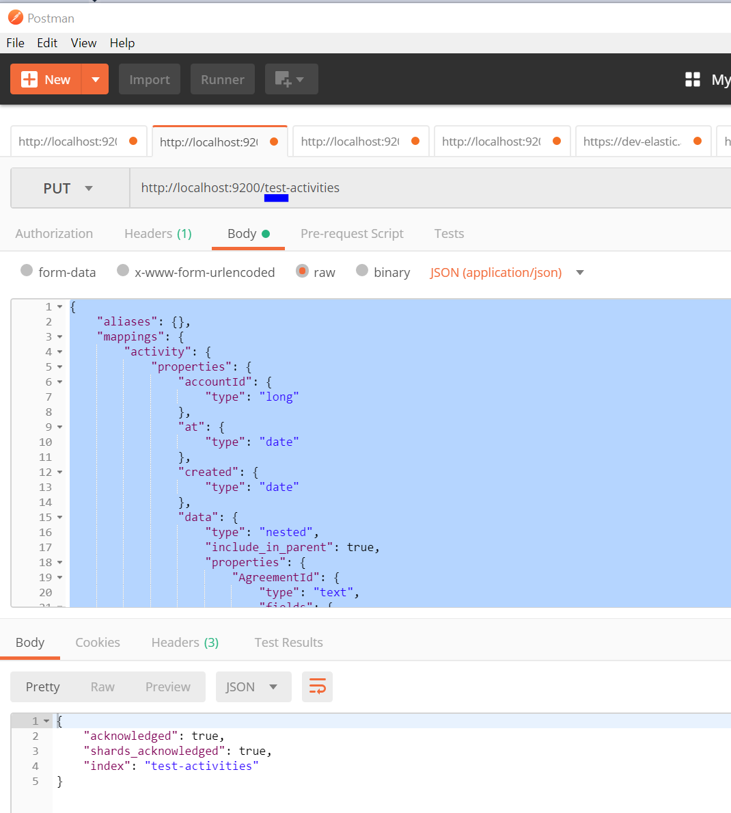
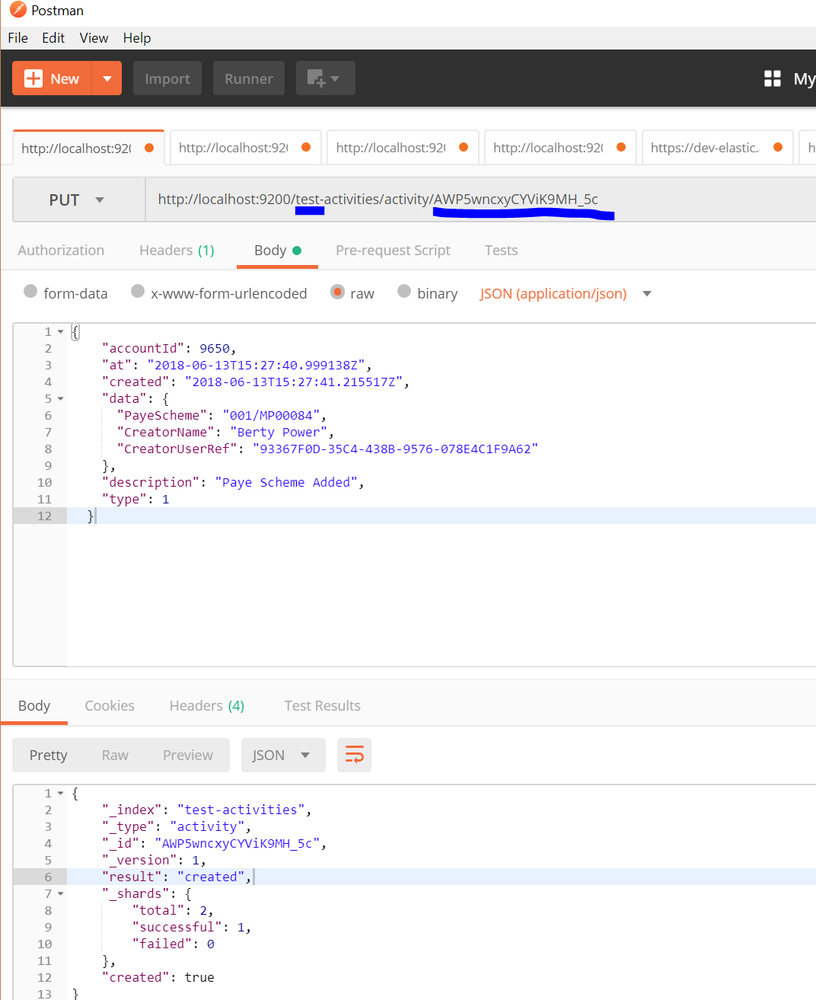

# Activities

`SFA.DAS.Activities.Worker` subscribes to events via Azure Service Bus and indexes them via Elastic Search. `SFA.DAS.Activities.Client` allows the data to be queried via Elastic Search.

|               |               |
| ------------- | ------------- |
|  | SFA.DAS.Activities |
| Build |  |

|               |               |
| ------------- | ------------- |
|  | SFA.DAS.Activities.Client |
| Client |  |

## Working With Local Index

**Objective**

_I want to run my queries against a local Index and put my own activities in to that. I have nothing running locally._

**Steps**

### Get Elastic and Kibana 

Foll the instruction on [[ReadMe.md | ReadMe]]. You need to end up with Elastic running on http://localhost:9200 and Kibana on localhost:5601/app.
If these are not coming up on those ports use `docker ps` and `docker logs _container-id_` to see the console output. 

## Install PostMan 
You need to make some HTTP requests. You can use curl or some other tool if you prefer. 

## Create the activity index locally

>If you intend to access the index programmatically note that the end point is `{environment}-activities` (in the screenshot this is `test-activities`). In code this environment will come from the app config.

The definition of the index must be match the activity documents that will be created. One way to get this is to GET the index definition from an existing index. Note that the response body needs a little editing - it can't simply be copy and pasted unfortunately. 

Remove the  outermost property to bring everything up a level. For example in the example remove the `{ "test-activities":` and the corresponding `}` at the end, leaving just the `{ .... }`. 

    {
    	"test-activities": { ..... }
    }

This can then be used a s the body to the your POST request

### Creating Documents

To create documents use the following PUT.

Note the url contains the name of the index and the id that will be used for the document.

### Copying existing documents

In a Kibana runa query find the documents that you want to copy.
Select to view the document in Json format. Then copy the source property value. This can then be used as the body to a PUT command.

 

  